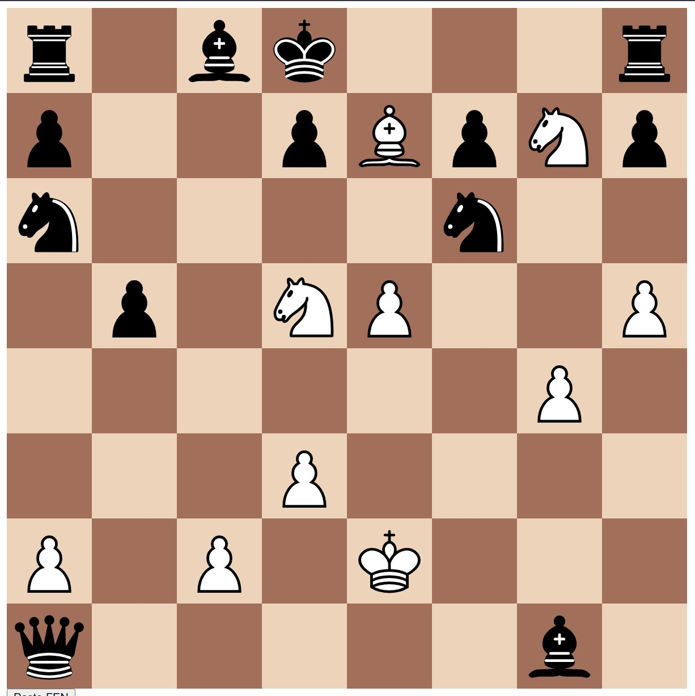

# Chess FEN Reader

A chess FEN reader which generates a board based on the FEN input.

</img>
###### *FEN: r1bk3r/p2pBpNp/n4n2/1p1NP2P/6P1/3P4/P1P1K3/q5b1*

## Roadmap
- [ ] Take input from user directly in browser using `input()` window
- [ ] Allow flipping the board
- [ ] Add letters and number on side of board
- [ ] Add feature showing what pieces have been captured
- [ ] Add terminal view in webpage
- [ ] Add board themes
- [ ] Add piece themes

## Contributing
If you wish to contribute, make sure to read the [CODE OF CONDUCT](CODE_OF_CONDUCT.md) and [Contributing guidelines](CONTRIBUTING.md) before doing so. 

## License
This project is licensed under the [MIT License](LICENSE.md).
